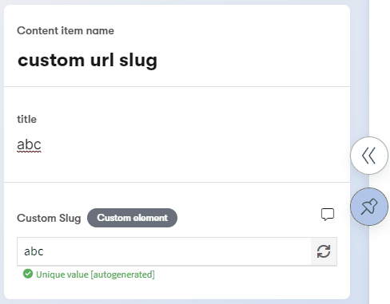

# Unique URL slug

This is a [custom element](https://docs.kontent.ai/tutorials/develop-apps/integrate/integrating-your-own-content-editing-features) for [Kontent by Kentico](https://kontent.ai) that generates a URL slug based on a text field or a custom value. It also checks for uniqueness of such value and can generated unique value if same url slug is found.



## Setup

1. Deploy the code to a secure public host
   - See [deploying section](#Deploying) for a really quick option
2. Follow the instructions in the [Kontent documentation](https://docs.kontent.ai/tutorials/develop-apps/integrate/integrating-your-own-content-editing-features#a-3--displaying-a-custom-element-in-kentico-kontent) to add the element to a content model.
   - The `Hosted code URL` is where you deployed to in step 1
   - Pass the necessary parameters as directed in the [JSON Parameters configuration](#json-parameters) section of this readme.
3. Deploy your server repeater for Preview API calls (details below)

## Deploying

Netlify has made this easy. If you click the deploy button below, it will guide you through the process of deploying it to Netlify and leave you with a copy of the repository in your GitHub account as well.

[](https://app.netlify.com/start/deploy?repository=https://github.com/hzik/custom-url-slug)

## JSON Parameters

You need to specify the `repeater` url, `generates_from` and `codename` parameters in order to make the element work. There are also optional `force_uniqueness` and `restricted_chars` parameters:

```Json
{
    "repeater": "https://domain.com/repeater",
    "generates_from": "title",
    "codename": "custom_slug",
    "force_uniqueness": "true", // default "false"
    "restricted_chars": "[^a-zA-Z0-9]" // default [^a-zA-Z0-9]
}
```
  - `repeater` -> A URL of a service you host on your server and that that forwards JSON from Preview API based on "/items?elements.<codename>[contains]=<value>&depth=0" query
  - `generates_from` -> A codename of a source Text element you want your url slug to be generated from
  - `codename` -> A codename of your Custom URL Slug element
  - `force_uniqueness` -> A true/false value that generates extra postfix to the url slug value in case the url slug is not unique
  - `restricted_chars` -> A set of characters (RegEx) you want the url slug to be restricted to

## Saved Value

The value is saved as an array of [<url slug value>, <autogenerated/manual>] so you know whether the value was generated automatically from the source element or whther it was entered manually:

```json
["abc","[manual]"]
```

